<p align="center">
  
</p>

<h1 align="center">🏙️ Smart Complaint System</h1>

<p align="center">
  <strong>A MERN stack application designed to streamline the process of reporting, managing, and resolving civic complaints. <br/>
  It features an intuitive user interface for citizens to lodge complaints and a robust admin panel for authorities to manage them efficiently.</strong>
</p>

<p align="center">
  <a href="https://smart-complaint-system-alpha.vercel.app/">
    
  </a>
</p>

<p align="center">
  
  
  
  
  
  
  
</p>

---

## 📸 Screenshots

### 👤 User Panel & Authentication

<details open>
<summary><strong>Authentication & Dashboard</strong></summary>
<br/>

| Login | Register |
|:---:|:---:|
| 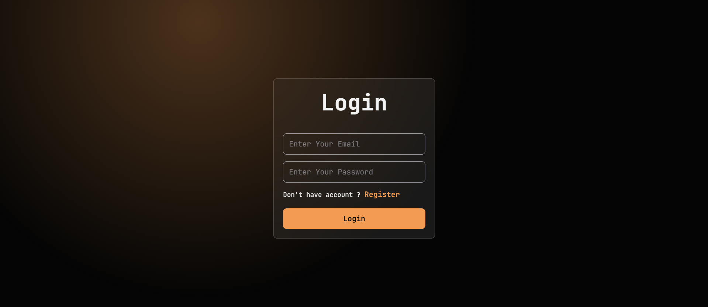 | 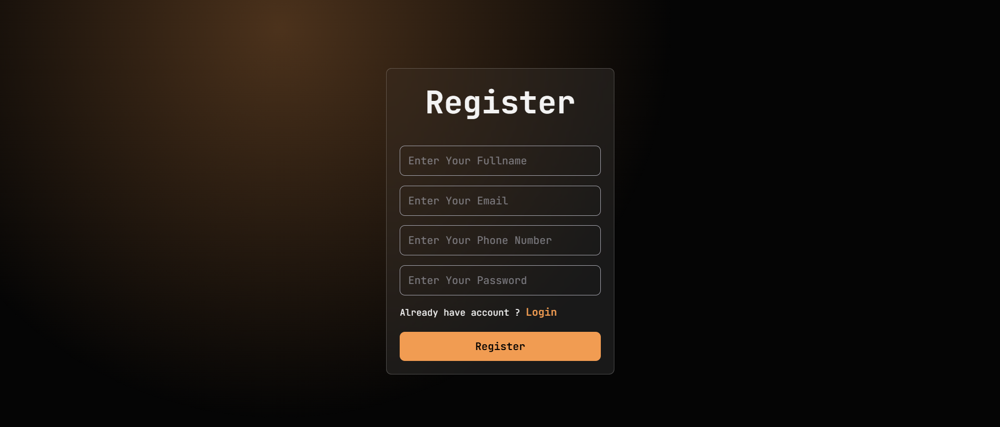 |

| My Complaints | Upload Complaint |
|:---:|:---:|
| 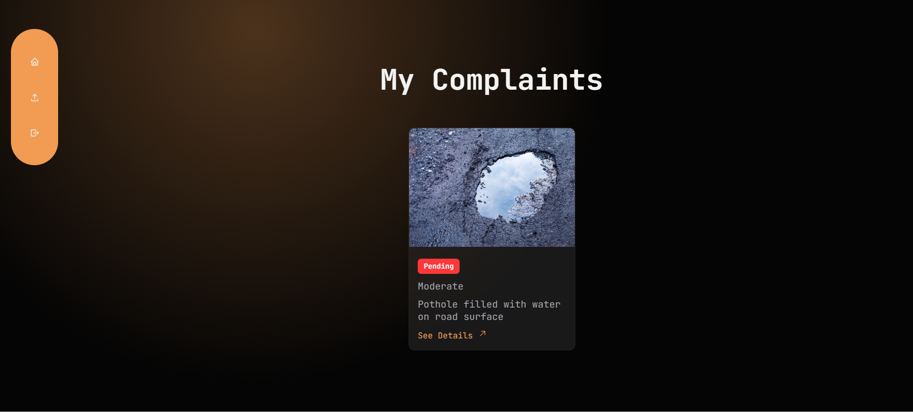 | 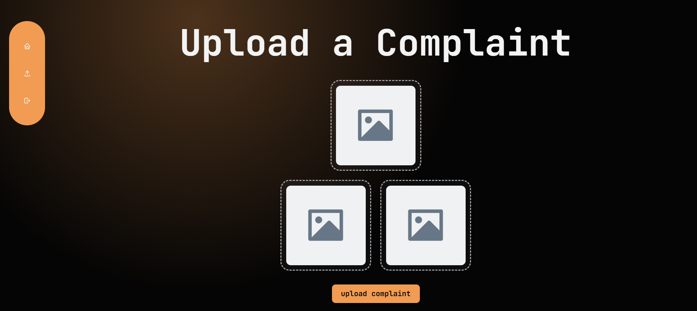 |

</details>

<details open>
<summary><strong>Complaint Details</strong></summary>
<br/>

| Complaint Overview | Tracking Status |
|:---:|:---:|
| 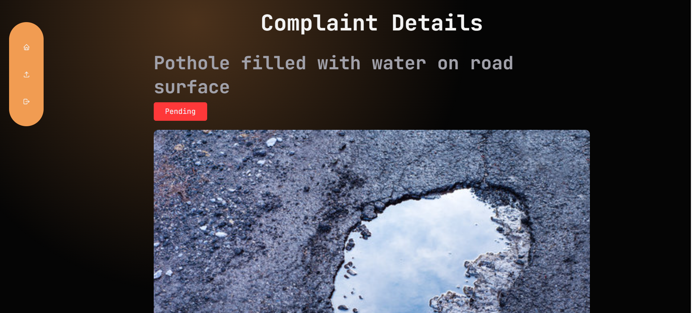 | 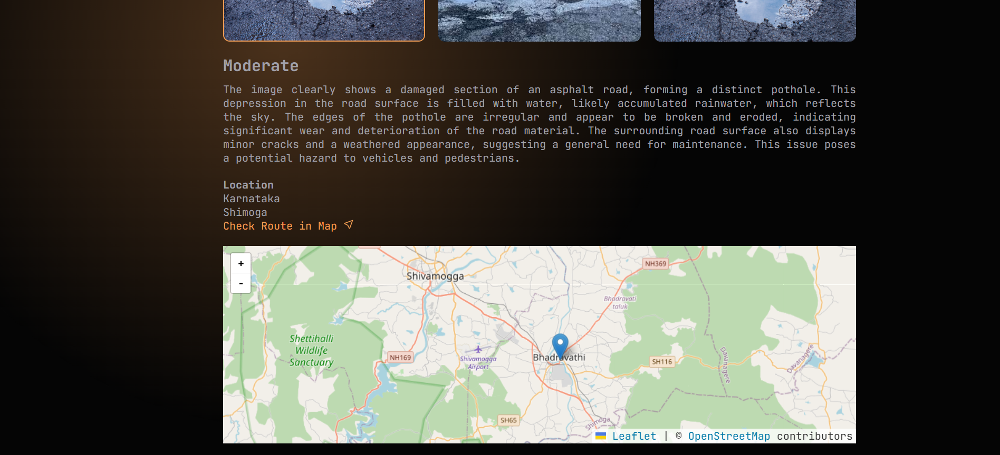 |

</details>

---

### 🛡️ Admin & Department Dashboard

<details open>
<summary><strong>Overview & Analytics</strong></summary>
<br/>

| Admin Dashboard | All Users |
|:---:|:---:|
| 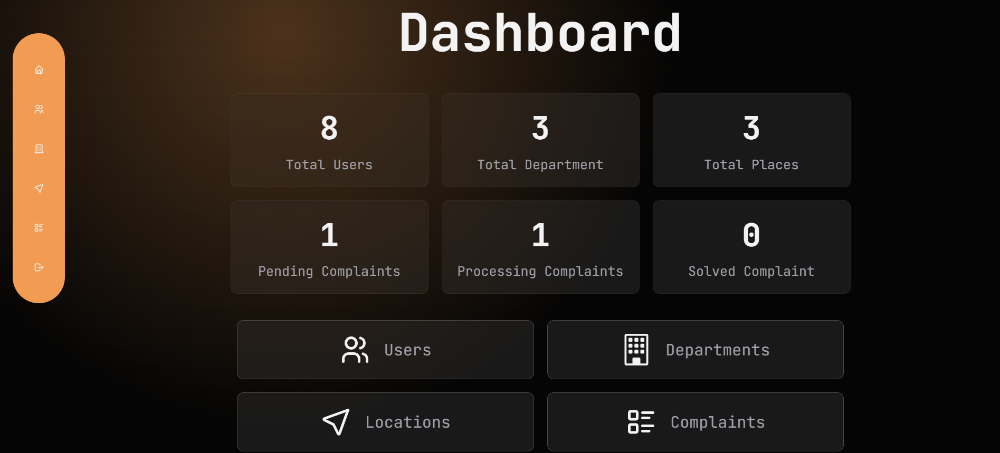 | 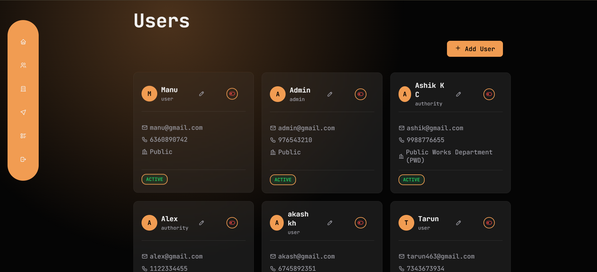 |

</details>

<details open>
<summary><strong>Locations & Departments Management</strong></summary>
<br/>

| Places List | Department List |
|:---:|:---:|
| 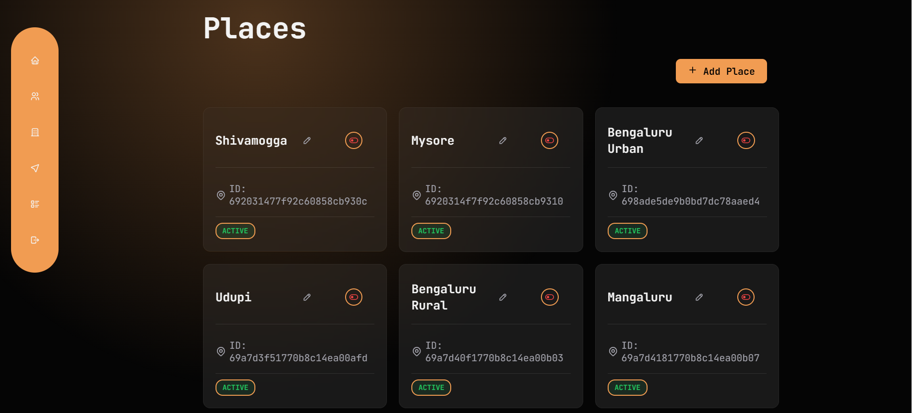 | 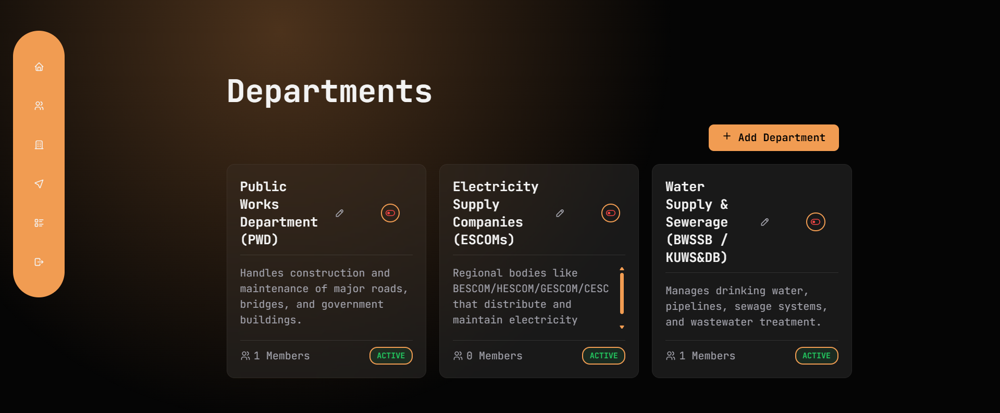 |


| Add Place Modal | Add Department Modal |
|:---:|:---:|
| 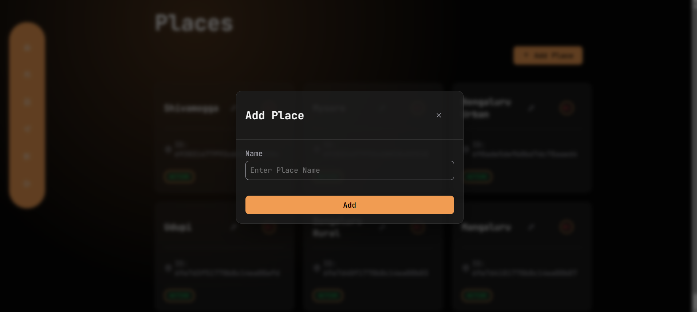 | 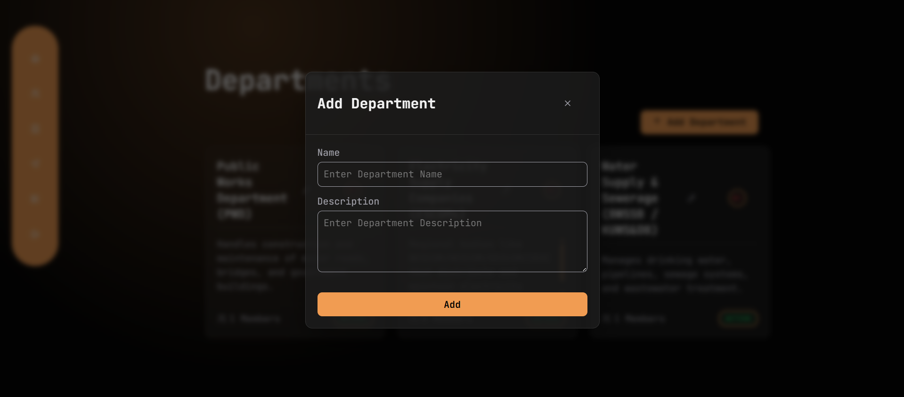 |

| Add User Modal | Department Complaints |
|:---:|:---:|
| 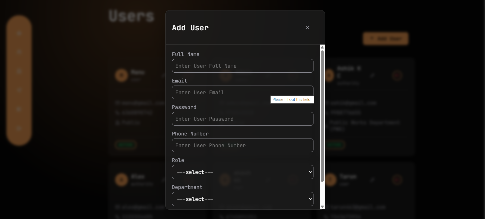 | 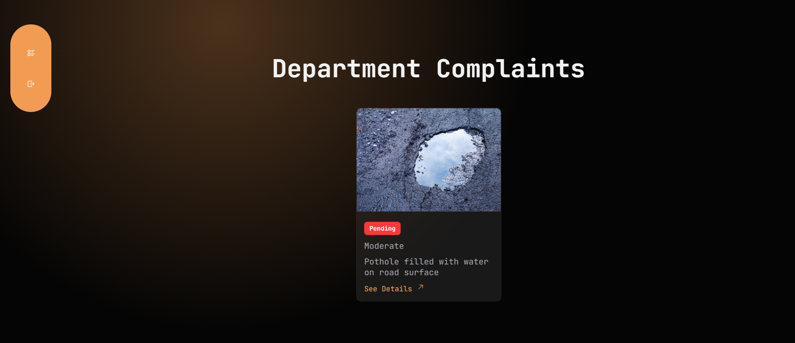 |

</details>

<details open>
<summary><strong>Complaint Workflows</strong></summary>
<br/>

| Department Specific Details | 
|:---:|
| 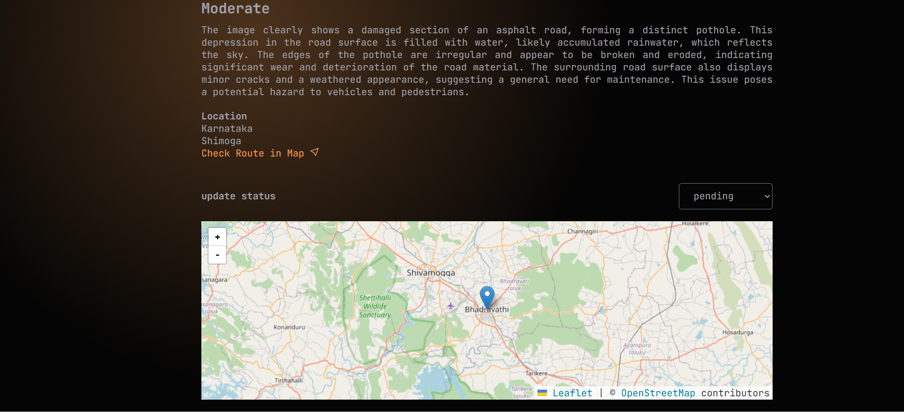 |

</details>


---

## ✨ Features

<table>
<tr>
<td width="50%" valign="top">

### 👤 User Panel
- **Authentication**: Secure Register/Login system (JWT).
- **Lodge Complaint**: Upload complaints containing images, title, layout, and description.
- **Location Integration**: Auto-detect user's location via Geolocation API and reverse geocoding via LocationIQ.
- **Track Status**: Monitor the status of reported complaints in real-time (`Pending` → `Processing` → `Resolved`).

</td>
<td width="50%" valign="top">

### 🛡️ Admin/Authority Panel
- **Dashboard Overview**: KPI visual representation of total, pending, and resolved complaints.
- **Manage Complaints**: View comprehensive details, locate on Map via React Leaflet, and update statuses.
- **Infrastructure Management**: Full CRUD operations for Departments, Users, and Places/Locations.
- **Visual AI Analysis**: Next-gen complaint image scanning using Google Gemini (backend) for smart tagging and verification.

</td>
</tr>
</table>

### ⚡ Infrastructure & Security
- **Appwrite** for blazingly fast and secure Image Storage and Management.
- **JSON Web Tokens (JWT)** based authentication using protected API routes.
- **Vercel** automated SPA routing with custom rewrite mappings.
- **Nodemailer** integrated for email notifications on critical events.

---

## 🏗️ Tech Stack

| Layer          | Technologies                                                          |
| -------------- | --------------------------------------------------------------------- |
| **Frontend**   | React (Vite), React Router, Axios, React Hot Toast, Tailwind CSS      |
| **Components** | React Leaflet (Maps Integration)                                      |
| **Backend**    | Node.js, Express 5                                                    |
| **Database**   | MongoDB Atlas, Mongoose 8                                             |
| **Auth**       | JSON Web Tokens (JWT), bcrypt                                         |
| **Storage**    | Appwrite (image uploads & file management)                            |
| **AI Vision**  | Google Gemini AI                                                      |

---

## 🚀 Getting Started

### Prerequisites

- **Node.js** ≥ 18
- **MongoDB** — local instance or [MongoDB Atlas](https://www.mongodb.com/atlas)
- **Appwrite** — [Cloud](https://cloud.appwrite.io) or self-hosted
- **Google Gemini API Key**
- **LocationIQ API Key**

### 1. Clone the Repository

```bash
git clone https://github.com/Manuacharya55/Smart_Complaint_System.git
cd Smart-Complaint-System
```

### 2. Setup the Server

```bash
cd server
npm install
```

Create a `.env` file inside the `server/` directory (refer to `.env.example`):

```env
PORT=5000
MONGO_URL=your_mongodb_connection_string
JWT_SECRET=your_jwt_secret
SALT_ROUNDS=10

GEMINI_API_KEY=your_gemini_api_key
APPWRITE_PROJECT_ID=your_appwrite_project_id
APPWRITE_KEY=your_appwrite_api_key

```

Start the server:

```bash
npm run dev
```

### 3. Setup the Client

```bash
cd ../client
npm install
```

Create a `.env` file inside `client/` (refer to `.env.example`):

```env
VITE_PROJECT_END_POINT=https://cloud.appwrite.io/v1
VITE_PROJECT_ID=your_appwrite_project_id
VITE_BUCKET_ID=your_appwrite_bucket_id
VITE_KEY=your_locationiq_api_key
VITE_BASE_URL=http://localhost:5000/api
```

Start the client:

```bash
npm run dev
```

### 4. Open in Browser

Visit **[http://localhost:5173](http://localhost:5173)** to start using the system ! 🎉

> **Note:** Make sure the backend server is running on port `5000` before starting the client.

---

## 🤝 Contributing

Contributions are welcome! Here's how you can help:

1. **Fork** the repository
2. **Create** a feature branch — `git checkout -b feature/amazing-feature`
3. **Commit** your changes — `git commit -m "Add amazing feature"`
4. **Push** to the branch — `git push origin feature/amazing-feature`
5. **Open** a Pull Request

> Please open an issue first to discuss major changes.

---

## 📄 License

This project is open source and available under the [MIT License](LICENSE).
